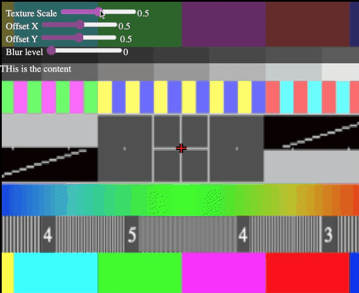
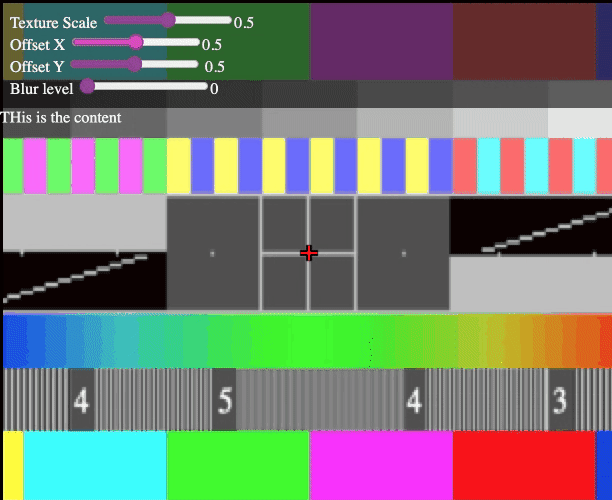
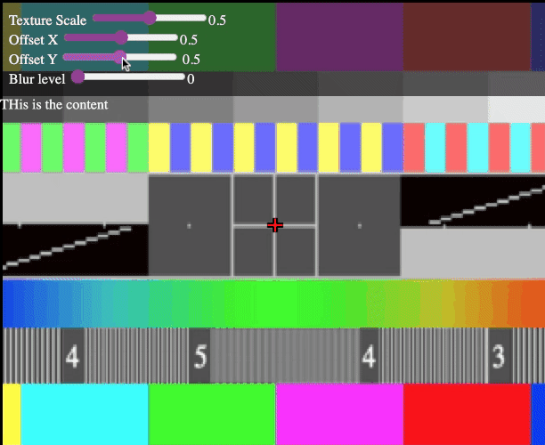
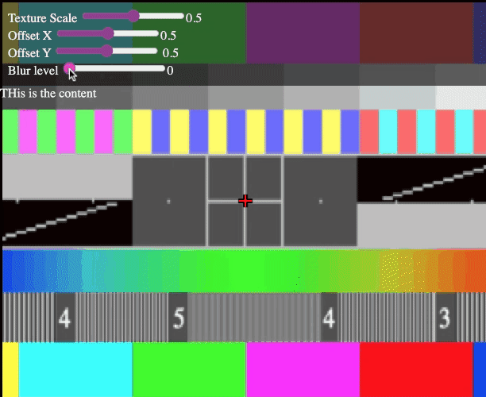

# WebGLElementBackground

An experiment in leveraging WebGL to generate animated backgrounds for VueJs components

## Gifs
| | |
|--------------|-----------|
|| |
|| |

## Requirements
- A browser that supports WebGL2

## Setup
- Get you the latest node
- Clone the repo
- Run `npm install` within the repo directory
- Run `npm run dev`
- Open the dev server within the browser

## Wip
- Make an easier way to bind HTML events/inputs to uniforms
- Expand on general architecture 

## To-DO
- Make more patterns

## Changelog

### 20-11-22
Created a `customRef` to trigger `uniform` updates. This allows the direct binding of `uniform` values to html inputs through Vue